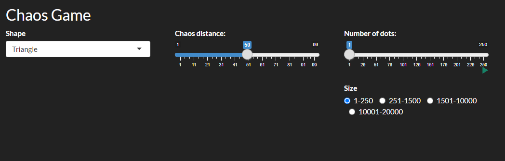

<style>
body
  {
  background-color: #222222;
  color: white;
  }
  
.code-box
  {
  background-color: #ECECEC;
  }
</style>

## Introducere

În matematică, *chaos game* reprezintă o metoda de a crea un fractal, începând cu un vârfurile unui poligon și un punct selectat în mod aleator. Un fractal este creat prin repetarea acestei alegeri aleatoare iar fiecare punct nou ales se află la o distanță fracționară între punctul curent și unul dintre colțurile poligonului (ales tot în mod aleator). Deci noul punct se află pe segmentul dintre punctul curent și vârful selectat. Prin repetarea acestui proces se poate ajunge la formarea unui fractal, însă nu întotdeauna. Cele mai cunoscute exemple de fractale ce pot fi generate cu ajutorul aplicației *chaos game* sunt trunghiul lui Sierpinski și poligoanele pentaflake și hexaflake, ce urmează să fie exemplificate în raport.

## Interfața aplicației

- **Shape**: opțiunea de alegere a unui poligon: triunghi, pătrat, pentagon sau hexagon.
- **Chaos distance**: distanța fracționară la care se vor afla punctele față de punctul precedent.
- **Number of dots**: câte punctul vor fi generate în total în figură.
- **Buton de play**: permite vizualizarea unei animații pentru generarea punctelor
- **Size**: opțiunea de a selecta un interval ce reprezintă numărul posibil de puncte din grafic.



## Partea de server

Pentru generarea punctelor din interiorul poligonului vom folosi 4 funcții, câte una pentru fiecare tip de poligon: triunghi, patrat, pentagon și hexagon. Vom lua în continuare ca exemplu funcția pentru triunghi:

```{r, class.source="code-box"}
# Functie pentru generarea triunghiului
triangle <- function (chaos_distance) 
{
  
  Nmax <- 20000
  
  tips <- matrix(NA, ncol = 3, nrow = 3)
  tips[1,] <- c(1, 0, 0)
  tips[2,] <- c(2, 1, 0)
  
  top_y = sqrt(3)/2
  tips[3,] <- c(3, 0.5, top_y)
  
  tips_nr <- sample(1:3, Nmax, replace = TRUE)
  list_of_points <- matrix(NA, ncol = 2, nrow = Nmax)
  
  rad3pe4 <- sqrt(3) / 4
  pointx <- runif(1, min = 0.25, max = 0.75)
  pointy <- runif(1, min = 0, max = rad3pe4)        # generarea primului punct in interiorul triunghiului
  list_of_points[1,] <- c(pointx, pointy)
  
  for (i in 1:(Nmax - 1)) {
    X <- tips[tips_nr[i], 2]
    Y <- tips[tips_nr[i], 3]
    
    X_new <- list_of_points[i, 1] + (X - list_of_points[i, 1]) * chaos_distance
    Y_new <- list_of_points[i, 2] + (Y - list_of_points[i, 2]) * chaos_distance
    
    list_of_points [i + 1, ] <- c(X_new, Y_new)
  }
  return (list (tips, list_of_points))
}

```

În matricea *tips* vom reține numărul de ordine și coordonatele fiecărui vârf al triunghiului. În *tips_nr* vom reține numărul de ordine al vârfurilor alese aleator. Cu ajutorul unui for loop vom calcula coordonatele tuturor punctelor ce urmează să fie generate și le vom salva în variabila *list_of_points*.

Parametrul *chaos_distance* reprezintă distanța fracționară ce trebuie parcursă de la punctul curent către vârful ales aleator. Acest parametru este selectat în partea de user interface cu ajutorul unui slider.

Generarea a 10 puncte aleatoare cu distanța dintre puncte de 50:
```{r, class.source="code-box"}
  Nmax <- 10
  chaos_distance <- 0.5
  
  tips <- matrix(NA, ncol = 3, nrow = 3)
  tips[1,] <- c(1, 0, 0)
  tips[2,] <- c(2, 1, 0)
  
  top_y = sqrt(3)/2
  tips[3,] <- c(3, 0.5, top_y)
  
  tips_nr <- sample(1:3, Nmax, replace = TRUE)
  list_of_points <- matrix(NA, ncol = 2, nrow = Nmax)
  
  rad3pe4 <- sqrt(3) / 4
  pointx <- runif(1, min = 0.25, max = 0.75)
  pointy <- runif(1, min = 0, max = rad3pe4)
  list_of_points[1,] <- c(pointx, pointy)
  
  for (i in 1:(Nmax - 1))
  {
    X <- tips[tips_nr[i], 2]
    Y <- tips[tips_nr[i], 3]
    
    X_new <- list_of_points[i, 1] + (X - list_of_points[i, 1]) * chaos_distance
    Y_new <- list_of_points[i, 2] + (Y - list_of_points[i, 2]) * chaos_distance
    
    list_of_points [i + 1, ] <- c(X_new, Y_new)
  }
```

Matricea vârfurilor triunghiului:
```{r, class.source="code-box"}
  tips
```

Lista vârfurilor din triunghiu alese în mod aleator:
```{r, class.source="code-box"}
  tips_nr
```

Matrice coordonatelor punctelor generate în interiorul triunghiului:
```{r, class.source="code-box"}
  list_of_points
```

## Exemple de fractale

```{r echo=FALSE, class.source="code-box"}

# Functie pentru generarea triunghiului
triangle <- function (chaos_distance) 
{
  
  Nmax <- 20000
  
  tips <- matrix(NA, ncol = 3, nrow = 3)
  tips[1,] <- c(1, 0, 0)
  tips[2,] <- c(2, 1, 0)
  
  top_y = sqrt(3)/2
  tips[3,] <- c(3, 0.5, top_y)
  
  tips_nr <- sample(1:3, Nmax, replace = TRUE)
  list_of_points <- matrix(NA, ncol = 2, nrow = Nmax)
  
  rad3pe4 <- sqrt(3) / 4
  pointx <- runif(1, min = 0.25, max = 0.75)
  pointy <- runif(1, min = 0, max = rad3pe4)        # generarea primului punct in interiorul triunghiului
  list_of_points[1,] <- c(pointx, pointy)
  
  for (i in 1:(Nmax - 1)) {
    X <- tips[tips_nr[i], 2]
    Y <- tips[tips_nr[i], 3]
    
    X_new <- list_of_points[i, 1] + (X - list_of_points[i, 1]) * chaos_distance
    Y_new <- list_of_points[i, 2] + (Y - list_of_points[i, 2]) * chaos_distance
    
    list_of_points [i + 1, ] <- c(X_new, Y_new)
  }
  return (list (tips, list_of_points))
}

# Functie pentru generarea patratului
square <- function (chaos_distance) 
{
  Nmax <- 20000
  
  tips <- matrix(NA, ncol = 3, nrow = 4)
  tips[1,] <- c(1, 0, 0)
  tips[2,] <- c(2, 1, 0)
  tips[3,] <- c(3, 1, 1)
  tips[4,] <- c(4, 0, 1) 
  
  tips_nr <- floor (runif (Nmax, 1, 5))
  
  list_of_points <- matrix(NA, ncol = 2, nrow = Nmax)
  
  list_of_points[1,] <- c(runif(1, min = 0, max = 1), runif(1, min = 0, max = 1))
  
  for (i in 1:(Nmax - 1)) 
  {
    X <- tips[tips_nr[i], 2]
    Y <- tips[tips_nr[i], 3]
    
    X_new <- list_of_points[i, 1] + (X - list_of_points[i, 1]) * chaos_distance
    Y_new <- list_of_points[i, 2] + (Y - list_of_points[i, 2]) * chaos_distance
    
    list_of_points [i + 1, ] <- c(X_new, Y_new)
  }
  return (list (tips, list_of_points))
}

# Functie pentru generarea pentagonului
pentagon <- function (chaos_distance) 
{
  Nmax <- 20000
  
  tips <- matrix(NA, ncol = 3, nrow = 5)
  tips[1,] <- c(1, 0.1875, 0)
  tips[2,] <- c(2, 0.8125, 0) 
  tips[3,] <- c(3, 1.0, 0.61175) 
  tips[4,] <- c(4, 0.5, 1)
  tips[5,] <- c(5, 0, 0.61175)
  
  tips_nr <- floor (runif (Nmax, 1, 6))
  
  list_of_points <- matrix(NA, ncol = 2, nrow = Nmax)
  
  list_of_points[1,] <- c(runif(1, min = 0, max = 1), runif(1, min = 0, max = 1))
  
  for (i in 1:(Nmax - 1)) 
  {
    X <- tips[tips_nr[i], 2]
    Y <- tips[tips_nr[i], 3]
    
    X_new <- list_of_points[i, 1] + (X - list_of_points[i, 1]) * chaos_distance
    Y_new <- list_of_points[i, 2] + (Y - list_of_points[i, 2]) * chaos_distance
    
    list_of_points [i + 1, ] <- c(X_new, Y_new)
  }
  return (list (tips, list_of_points))
}

# Functie pentru generarea hexagonului
hexagon <- function (chaos_distance) 
{
  Nmax <- 20000
  
  tips <- matrix(NA, ncol = 3, nrow = 6) 
  tips[1,] <- c(1, 0.5, 1) 
  tips[2,] <- c(2, 0.9, 0.75) 
  tips[3,] <- c(3, 0.9, 0.25) 
  tips[4,] <- c(4, 0.5, 0)
  tips[5,] <- c(5, 0.1, 0.25)
  tips[6,] <- c(6, 0.1, 0.75)
  
  tips_nr <- floor (runif (Nmax, 1, 7))
  
  list_of_points <- matrix(NA, ncol = 2, nrow = Nmax)
  
  list_of_points[1,] <- c(runif(1, min = 0, max = 1), runif(1, min = 0, max = 1))
  
  for (i in 1:(Nmax - 1)) 
  {
    X <- tips[tips_nr[i], 2]
    Y <- tips[tips_nr[i], 3]
    
    X_new <- list_of_points[i, 1] + (X - list_of_points[i, 1]) * chaos_distance
    Y_new <- list_of_points[i, 2] + (Y - list_of_points[i, 2]) * chaos_distance
    
    list_of_points [i + 1, ] <- c(X_new, Y_new)
  }
  return (list (tips, list_of_points))
}

```

- Triunghi: chaos distance = 50, number of points = 20000 (Triunghiul lui Sierpinski)
 
```{r echo=FALSE, fig.width=5, fig.height=5, class.source="code-box"}
    Nmax = 20000

    data = triangle(0.5)
    
    tips  <- data[[1]]
    list_of_points <- data[[2]]
    
    
    par(bg = "#222222")
    
    plot(0, 0, xlim = c(0, 1), ylim = c(0, 1), col = 0, yaxt = "n", xaxt = "n", xlab = "", ylab = "", bty = "n")
    points(list_of_points[1 : Nmax - 1, 1], list_of_points[1 : Nmax - 1, 2], pch = 46, col = "white")  
    points(tips[, 2],tips[, 3], pch = 46, cex = 2, col = "cornflowerblue")
```

- Patrat: chaos distance = 50, number of points = 20000 
 
```{r echo=FALSE, fig.width=5, fig.height=5, class.source="code-box"}
    Nmax = 20000

    data = square(0.5)
    
    tips  <- data[[1]]
    list_of_points <- data[[2]]
    
    par(bg = "#222222")
    
    plot(0, 0, xlim = c(0, 1), ylim = c(0, 1), col = 0, yaxt = "n", xaxt = "n", xlab = "", ylab = "", bty = "n")
    points(list_of_points[1 : Nmax, 1], list_of_points[1 : Nmax, 2], pch = 46, col = "white")
    points(tips[,2], tips[,3], pch = 46, cex = 2, col = "cornflowerblue")
```
    
- Pentagon: chaos distance = 62, number of points = 20000 (Pentaflake)
 
```{r echo=FALSE, fig.width=5, fig.height=5, class.source="code-box"}
    Nmax = 20000

    data = pentagon(0.62)
    
    tips  <- data[[1]]
    list_of_points <- data[[2]]
    
    par(bg = "#222222")
    
    plot(0, 0, xlim = c(0, 1), ylim = c(0, 1), col = 0, yaxt = "n", xaxt = "n", xlab = "", ylab = "", bty = "n")
    points(list_of_points[1 : Nmax, 1], list_of_points[1 : Nmax, 2], pch = 46, col = "white")
    points(tips[,2], tips[,3], pch = 46, cex = 2, col = "cornflowerblue")
```

- Hexagon: chaos distance = 67, number of points = 20000 (Hexaflake)
 
```{r echo=FALSE, fig.width=5, fig.height=5, class.source="code-box"}
    Nmax = 20000

    data = hexagon(0.67)
    
    tips  <- data[[1]]
    list_of_points <- data[[2]]
    
    par(bg = "#222222")
    
    plot(0, 0, xlim = c(0, 1), ylim = c(0, 1), col = 0, yaxt = "n", xaxt = "n", xlab = "", ylab = "", bty = "n")
    points(list_of_points[1 : Nmax, 1], list_of_points[1 : Nmax, 2], pch = 46, col = "white")
    points(tips[,2], tips[,3], pch = 46, cex = 2, col = "cornflowerblue")
```

### Implementarea completă

```{class.source="code-box"}
# Proiect realizat de Buta Gabriel, Lazaroiu Teodora, Roman Andrei (grupa 241)

library(shiny)
library(shape)
library(shinythemes)

# Interfata

ui <- fluidPage(
  theme = shinytheme("darkly"),
  titlePanel("Chaos Game"),
  
  
  fluidRow(
    # Alegerea formei
    column(4,
           selectizeInput('shape', label = "Shape", choices = c(
             'Triangle' = 'triangle',
             'Square' = 'square',
             'Pentagon' = 'pentagon',
             'Hexagon' = 'hexagon'
           ))
    ),
    # Alegerea distantei
    column(4,
           sliderInput("distance",
                       "Chaos distance:",
                       min = 1,
                       max = 99,
                       value = 50)),
    # Alegerea numarului de puncte afisate
    column(4,
           conditionalPanel(
             condition = "input.size_of_chaos == 1",
             sliderInput("nr_points_small",
                         "Number of dots:",
                         min = 1,
                         max = 250,
                         value = 1,
                         step = 1,
                         animate=animationOptions(interval = 100)
             )
           ),
           conditionalPanel(
             condition = "input.size_of_chaos == 2",
             sliderInput("nr_points_medium",
                         "Number of dots:",
                         min = 251,
                         max = 1500,
                         value = 251,
                         step = 20,
                         animate=animationOptions(interval = 100)
             )
           ),
           conditionalPanel(
             condition = "input.size_of_chaos == 3",
             sliderInput("nr_points_big",
                         "Number of dots:",
                         min = 1501,
                         max = 10000,
                         value = 1501,
                         step = 100,
                         animate=animationOptions(interval = 100)
             )
           ),
           conditionalPanel(
             condition = "input.size_of_chaos == 4",
             sliderInput("nr_points_huge",
                         "Number of dots:",
                         min = 10001,
                         max = 20000,
                         value = 10001,
                         step = 100,
                         animate=animationOptions(interval = 100)
             )
           ),
           # Alegerea intervalului de puncte afisate
           radioButtons("size_of_chaos","Size", c("1-250" = "1", "251-1500" = "2", "1501-10000" = "3", "10001-20000" = "4"), inline = T),
    )
  ),
  mainPanel( 
    fluidRow(
      # Afisarea figurii
      column(4,
             plotOutput("distPlot")),
      column(4,
             conditionalPanel(
               condition = "input.size_of_chaos == 1",
               plotOutput("plot_small", width = "500px", height = "500px")),
             
             conditionalPanel(
               condition = "input.size_of_chaos == 2",
               plotOutput("plot_medium", width = "500px", height = "500px")),
             
             conditionalPanel(
               condition = "input.size_of_chaos == 3",
               plotOutput("plot_big", width = "500px", height = "500px")),
             
             conditionalPanel(
               condition = "input.size_of_chaos == 4",
               plotOutput("plot_huge", width = "500px", height = "500px")),
      )
    )
  )
)

# Serverul

# Functie pentru generarea triunghiului
triangle <- function (chaos_distance) 
{
  
  Nmax <- 20000
  
  tips <- matrix(NA, ncol = 3, nrow = 3)
  tips[1,] <- c(1, 0, 0)
  tips[2,] <- c(2, 1, 0)
  
  top_y = sqrt(3)/2
  tips[3,] <- c(3, 0.5, top_y)
  
  tips_nr <- sample(1:3, Nmax, replace = TRUE)
  list_of_points <- matrix(NA, ncol = 2, nrow = Nmax)
  
  rad3pe4 <- sqrt(3) / 4
  pointx <- runif(1, min = 0.25, max = 0.75)
  pointy <- runif(1, min = 0, max = rad3pe4)        # generarea primului punct in interiorul triunghiului
  list_of_points[1,] <- c(pointx, pointy)
  
  for (i in 1:(Nmax - 1)) {
    X <- tips[tips_nr[i], 2]
    Y <- tips[tips_nr[i], 3]
    
    X_new <- list_of_points[i, 1] + (X - list_of_points[i, 1]) * chaos_distance
    Y_new <- list_of_points[i, 2] + (Y - list_of_points[i, 2]) * chaos_distance
    
    list_of_points [i + 1, ] <- c(X_new, Y_new)
  }
  return (list (tips, list_of_points))
}

# Functie pentru generarea patratului
square <- function (chaos_distance) 
{
  Nmax <- 20000
  
  tips <- matrix(NA, ncol = 3, nrow = 4)
  tips[1,] <- c(1, 0, 0)
  tips[2,] <- c(2, 1, 0)
  tips[3,] <- c(3, 1, 1)
  tips[4,] <- c(4, 0, 1) 
  
  tips_nr <- floor (runif (Nmax, 1, 5))
  
  list_of_points <- matrix(NA, ncol = 2, nrow = Nmax)
  
  list_of_points[1,] <- c(runif(1, min = 0, max = 1), runif(1, min = 0, max = 1))
  
  for (i in 1:(Nmax - 1)) 
  {
    X <- tips[tips_nr[i], 2]
    Y <- tips[tips_nr[i], 3]
    
    X_new <- list_of_points[i, 1] + (X - list_of_points[i, 1]) * chaos_distance
    Y_new <- list_of_points[i, 2] + (Y - list_of_points[i, 2]) * chaos_distance
    
    list_of_points [i + 1, ] <- c(X_new, Y_new)
  }
  return (list (tips, list_of_points))
}

# Functie pentru generarea pentagonului
pentagon <- function (chaos_distance) 
{
  Nmax <- 20000
  
  tips <- matrix(NA, ncol = 3, nrow = 5)
  tips[1,] <- c(1, 0.1875, 0)
  tips[2,] <- c(2, 0.8125, 0) 
  tips[3,] <- c(3, 1.0, 0.61175) 
  tips[4,] <- c(4, 0.5, 1)
  tips[5,] <- c(5, 0, 0.61175)
  
  tips_nr <- floor (runif (Nmax, 1, 6))
  
  list_of_points <- matrix(NA, ncol = 2, nrow = Nmax)
  
  list_of_points[1,] <- c(runif(1, min = 0, max = 1), runif(1, min = 0, max = 1))
  
  for (i in 1:(Nmax - 1)) 
  {
    X <- tips[tips_nr[i], 2]
    Y <- tips[tips_nr[i], 3]
    
    X_new <- list_of_points[i, 1] + (X - list_of_points[i, 1]) * chaos_distance
    Y_new <- list_of_points[i, 2] + (Y - list_of_points[i, 2]) * chaos_distance
    
    list_of_points [i + 1, ] <- c(X_new, Y_new)
  }
  return (list (tips, list_of_points))
}

# Functie pentru generarea hexagonului
hexagon <- function (chaos_distance) 
{
  Nmax <- 20000
  
  tips <- matrix(NA, ncol = 3, nrow = 6) 
  tips[1,] <- c(1, 0.5, 1) 
  tips[2,] <- c(2, 0.9, 0.75) 
  tips[3,] <- c(3, 0.9, 0.25) 
  tips[4,] <- c(4, 0.5, 0)
  tips[5,] <- c(5, 0.1, 0.25)
  tips[6,] <- c(6, 0.1, 0.75)
  
  tips_nr <- floor (runif (Nmax, 1, 7))
  
  list_of_points <- matrix(NA, ncol = 2, nrow = Nmax)
  
  list_of_points[1,] <- c(runif(1, min = 0, max = 1), runif(1, min = 0, max = 1))
  
  for (i in 1:(Nmax - 1)) 
  {
    X <- tips[tips_nr[i], 2]
    Y <- tips[tips_nr[i], 3]
    
    X_new <- list_of_points[i, 1] + (X - list_of_points[i, 1]) * chaos_distance
    Y_new <- list_of_points[i, 2] + (Y - list_of_points[i, 2]) * chaos_distance
    
    list_of_points [i + 1, ] <- c(X_new, Y_new)
  }
  return (list (tips, list_of_points))
}


server <- function(input, output) 
{
  
  figure <- reactive({
    if (input$shape == "triangle") {
      return (triangle((input$distance / 100)))
    }
    if (input$shape == "square") {
      return (square((input$distance / 100)))
    }
    if (input$shape == "pentagon") {
      return (pentagon((input$distance / 100)))
    }
    if (input$shape == "hexagon") {
      return (hexagon((input$distance / 100)))
    }
  })
  
  # Afisarea figurii in functie de intervalul de puncte ales
  output$plot_small <- renderPlot ({
    
    tips  <- figure()[[1]]
    list_of_points  <- figure()[[2]]
    
    par(bg = "#222222")
    
    plot(0, 0, xlim = c(0, 1), ylim = c(0, 1), col = 0, yaxt = "n", xaxt = "n", xlab = "", ylab = "", bty = "n")
    
    points(list_of_points[1 : input$nr_points_small - 1, 1], list_of_points[1 : input$nr_points_small - 1, 2], pch = 20, col = "white")  
    
    
    points(tips[, 2],tips[, 3], pch = 20, cex = 2, col = "cornflowerblue")
    
  })
  output$plot_medium <- renderPlot ({
    tips  <- figure()[[1]]
    list_of_points  <- figure()[[2]]
    
    par(bg = "#222222")
    
    plot(0, 0, xlim = c(0, 1), ylim = c(0, 1), col = 0, yaxt = "n", xaxt = "n", xlab = "", ylab = "", bty = "n")
    
    points(list_of_points[1 : input$nr_points_medium, 1], list_of_points[1 : input$nr_points_medium, 2], pch = 46, col = "white")  
    
    
    points(tips[,2], tips[,3], pch = 20, cex = 2, col = "cornflowerblue")
    
  })
  output$plot_big <- renderPlot ({
    tips  <- figure()[[1]]
    list_of_points  <- figure()[[2]]
    
    par(bg = "#222222")
    
    plot(0, 0, xlim = c(0, 1), ylim = c(0, 1), col = 0, yaxt = "n", xaxt = "n", xlab = "", ylab = "", bty = "n")
    
    points(list_of_points[1 : input$nr_points_big, 1], list_of_points[1 : input$nr_points_big, 2], pch = 46, col = "white")  
    
    
    points(tips[, 2], tips[, 3], pch = 20, cex = 2, col = "cornflowerblue")
    
  })
  output$plot_huge <- renderPlot ({
    tips  <- figure()[[1]]
    list_of_points  <- figure()[[2]]
    
    par(bg = "#222222")
    
    plot(0, 0, xlim = c(0, 1), ylim = c(0, 1), col = 0, yaxt = "n", xaxt = "n", xlab = "", ylab = "", bty = "n")
    
    points(list_of_points[1 : input$nr_points_huge, 1], list_of_points[1 : input$nr_points_huge, 2], pch = 46, col = "white")  
    
    
    points(tips[, 2], tips[, 3], pch = 20, cex = 2, col = "cornflowerblue")
    
  })
  
}

shinyApp(ui = ui, server = server)
```